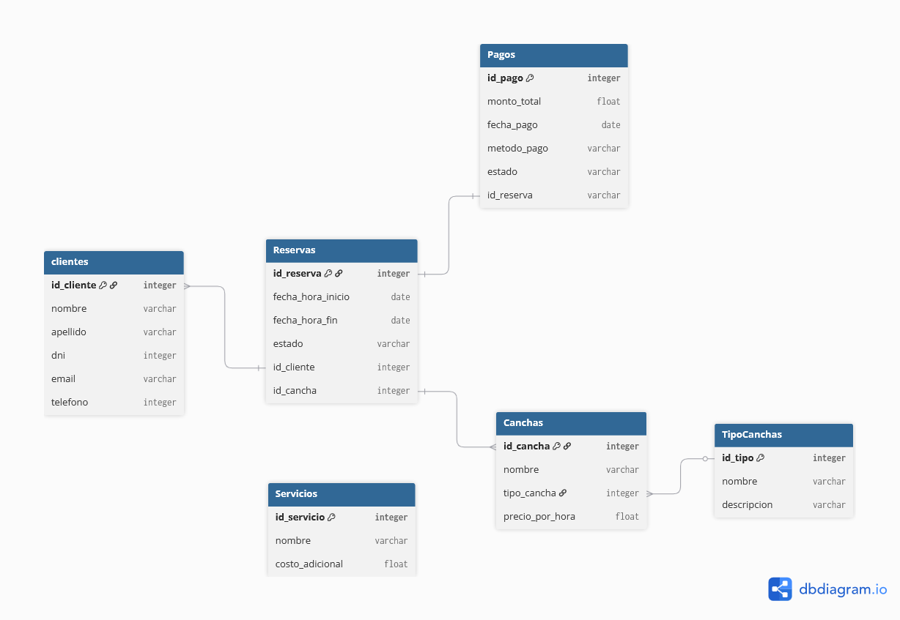

# ⚽ Sistema de Reservas de Canchas Deportivas

Este proyecto es un **Trabajo Práctico Integrador** para la materia DAO, enfocado en el desarrollo de una aplicación web completa para la gestión de reservas de canchas deportivas.

El sistema permite a los administradores gestionar clientes, canchas y horarios, mientras que los usuarios pueden registrar y administrar sus reservas de forma sencilla.

---

## ✨ Funcionalidades Principales

El sistema cubre todas las operaciones necesarias para la administración de un complejo deportivo.

* [cite_start]**Gestión (ABM):** Administración completa de **clientes**, **canchas** y **horarios** disponibles. [cite: 3]
* [cite_start]**Reservas:** Registro de nuevas reservas, asociando un cliente a una cancha en una fecha y hora específicas. [cite: 4]
* [cite_start]**Validación de Disponibilidad:** El sistema verifica automáticamente que una cancha no esté ocupada antes de confirmar una nueva reserva. [cite: 5]
* [cite_start]**Gestión de Torneos:** Funcionalidad para organizar y administrar campeonatos. [cite: 6]
* [cite_start]**Servicios Adicionales:** Control de servicios asociados como la iluminación de la cancha. [cite: 7]
* [cite_start]**Pagos Online:** Módulo opcional para la administración de pagos en línea. [cite: 14]

---

## 📊 Reportes y Estadísticas

La aplicación es capaz de generar reportes detallados y visualizaciones para el análisis del negocio.

* **Listados Detallados:**
    * [cite_start]Reservas por cliente. [cite: 9]
    * [cite_start]Reservas por cancha en un período de tiempo determinado. [cite: 10]
    * [cite_start]Ranking de las canchas más utilizadas. [cite: 11]
* **Gráficos Estadísticos:**
    * [cite_start]Visualización del uso mensual de las canchas para analizar tendencias. [cite: 12]

---

## 🛠️ Tecnologías Utilizadas

* **Backend Framework:** Django
* **Base de Datos:** SQLite / MySQL
* **Frontend:** HTML, CSS, JavaScript (integrado en templates de Django)

---

## 💾 Modelo de Base de Datos

El sistema se estructura en torno al siguiente Modelo Entidad-Relación (MER):



---

## 🚀 Cómo Empezar

Sigue estos pasos para levantar el proyecto en tu entorno local.

1.  **Clonar el repositorio:**
    ```bash
    git clone https://github.com/GibertSalva/DAO-Trabjao-Practico-Integrador-Tema-1-G60-.git
    cd DAO-Trabjao-Practico-Integrador-Tema-1-G60-.git
    ```

2.  **Instalar dependencias:**
    ```bash
    pip install -r requirements.txt
    ```

3.  **Aplicar las migraciones de la base de datos:**
    ```bash
    python manage.py migrate
    ```

4.  **Crear un superusuario (para acceder al admin):**
    ```bash
    python manage.py createsuperuser
    ```

5.  **Iniciar el servidor de desarrollo:**
    ```bash
    python manage.py runserver
    ```

¡Listo! Ahora puedes acceder a la aplicación en `http://127.0.0.1:8000`.

---

## 👥 Integrantes del Grupo

* [Salvador Gibert]
* [Ignacio Maspero]
* [Tiziana Carrizo]
* [Agustin Rey Laje]
* [Marco Figueroa]